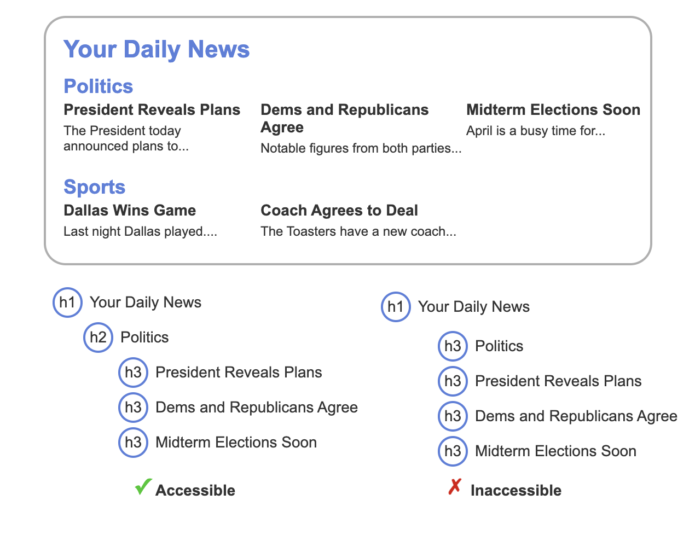

<style>
	h1 {
		width: 100%;
		height: 100%;
		text-align: center;
		display: flex;
		justify-content: center;
		align-items: center;
	}

	img {
		display: block;
		max-width: 100%;
		height: auto;
		max-height: 100%;
		margin: 0 auto;
	}
</style>

# Accessibility - SDEV153 Lecture 4

---

# Introduction to Accessibility

---

## Accessibility

- **disability** - A disability is a physical or mental condition that impairs a person's activities.
  - Visual
  - Auditory
  - Auditory
  - Physical
  - Cognitive

---

## Web Accessibility

- **Web accessibility** - Web accessibility is the practice of making websites and web tools usable by people with disabilities.

We often need to accommodate for different kinds of same disabilities when designing and developing websites. Such as Blindness vs Low Vision vs Color Blindness.

_Accessibility is often denoted with numeronym a11y since 11 letters exist between the "a" and "y" in the word "accessibility"._

---

## Assistive technologies

- **Assistive technology (AT)** - are tools that help people with disabilities perform functions that are normally difficult or impossible to perform

- **Screen reader** - Used to output webpage content as audio or braille for people who are blind or struggle to read text.

- **Screen magnifier** - Used to magnify webpage content for people with low vision.

---

## Assistive technologies (cont.)

- **Keyboard or joystick** - Used to navigate by people who lack the dexterity to use a mouse or can't see a mouse pointer.
- **Voice recognition** - Used to control a computer by people who are unable to or struggle to move their limbs.

- **Eye tracking** - Used to move a screen cursor by people who are unable to use a mouse or joystick and unable to speak clearly.

---

## WCAG

- **Web Content Accessibility Guidelines (WCAG)** - A set of guidelines developed by the World Wide Web Consortium (W3C) to make web content more accessible to people with disabilities.
- **conformance levels** - WCAG defines three conformance levels: A (lowest), AA, and AAA (highest).
- **POUR** - WCAG is organized around four principles, which form the acronym POUR.

---

## POUR

- **Perceivable** - Content is presented in ways that allow all users to perceive the content.

- **Operable** - All users can operate the user interface and navigate in different ways.

- **Understandable** - All users can understand the content.

- **Robust** - Content can be interpreted by many browsers, media players, and ATs.

---

# a11y Evaluation

---

## Accessibility Evaluation Tools

- **WebAIM Contrast Checker** - is a web accessibility tool that calculates the contrast ratio between a foreground color and background color.

- **WAVE Evaluation Tool** - is a free accessibility tool developed by WebAIM that identifies many WCAG violations in a webpage.

_**Not all WCAG criteria can be automatically evaluated**. Ex: WCAG specifies that images should have alt text. A tool can flag images that are missing alt text, but a person must manually evaluate if the alt text accurately describes the image._

---

## Using Screen Readers

Sighted users can use a screen reader to better understand how blind users experience a website.

- NVDA and JAWS - For Windows
- VoiceOver - For Mac OS and iOS
- TalkBack - For Android

### Screen Reader Demo

https://youtu.be/IizCS7PXWgs

---

# Page Structure for a11y

---

## Headings

- **landmark** - Heading and other semantic elements act as a landmark, a special location within a webpage that ATs can effectively navigate.

---

<style scoped>
img {
	width: 800px;
}
</style>



---

## Semantic elements

- header
- footer
- nav
- main
- section
- article
- aside

_Span and div elements do not have semantic meaning and should only be used when no semantic element is appropriate._

---

# WAI-ARIA

---

## Roles, properties, and states

- **WAI-ARIA (Web Accessibility Initiative** - Accessible Rich Internet Applications) is a W3C specification that defines additional HTML attributes for adding missing semantics

- **role** - defines what an element is or does, and is specified with the role attribute
- **property** - defines characteristics of an element, and is specified with the aria- attribute
- **state** - state defines an element's current condition, and is specified with attributes beginning with aria-

---

## Role, Property, and State Examples

```html
<button role="button" aria-pressed="false">Like</button>

<!-- or -->

<div
  role="progressbar"
  aria-valuenow="25"
  aria-valuemin="0"
  aria-valuemax="100"
></div>

<!-- or -->
<div role="navigation"></div>
```

---

## Common ARIA Roles

<style scoped>
	td {
		font-size: 32px
	}
</style>

| Category           | Description                                     | Roles                                                   |
| ------------------ | ----------------------------------------------- | ------------------------------------------------------- |
| Widget             | Standalone and composite user interface widgets | button, checkbox, menuitem, tab, combobox, grid, menu   |
| Document structure | Structures that organize page content           | article, definition, feed, heading, img, table, toolbar |
| Landmark           | Page regions intended as navigational landmarks | banner, complementary, form, main, navigation, search   |
| Live region        | Page regions that are updated dynamically       | alert, log, marquee, status, timer                      |

---

## Alert example

_No HTML element has an alert's semantic meaning, so role="alert" is added to a div element to create the alert._

- **aria-label attribute** supplies an accessible name for an element
- **aria-hidden** attribute indicates if an element is exposed to AT.

```html
<button type="button" id="alert-btn">Show Alert</button>

<div id="alert-example" role="alert" class="hidden">
  This is an alert!
  <button type="button" class="close" aria-label="Close">
    <span aria-hidden="true">&times;</span>
  </button>
  <div></div>
</div>
```

---

<style scoped>
	section { 
		display: flex;
		flex-grow: 1;
		gap: 1rem;
		align-items: center;
	}

	section > * {
		flex-grow: 1;
		height: 100%;
	}
</style>

```html
<style>
  body {
    font-family: Arial;
  }

  [role="alert"] {
    background-color: #f8d7da;
    border: 1px solid #f5c6cb;
    border-radius: 5px;
    margin: 10px;
    padding: 15px;
  }

  .close {
    font-weight: bold;
    font-size: 1.5rem;
    line-height: 1;
    float: right;
    position: relative;
    top: -5px;
    cursor: pointer;
    background-color: transparent;
    border: 0;
  }

  .hidden {
    display: none;
  }
</style>
```

```html
<script>
  // Show the alert
  document.querySelector("#alert-btn").addEventListener("click", function () {
    const alert = document.querySelector("#alert-example");
    alert.classList.remove("hidden");
  });

  // Close the alert
  document.querySelector(".close").addEventListener("click", function () {
    const alert = document.querySelector("#alert-example");
    alert.classList.add("hidden");
  });
</script>
```

---

# Colors a11y

---

## Contrast

- **Color contrast** - is the difference in brightness between two colors.
- **Contrast ratio** - is the ratio of brightness between two colors

**Minimum contrast ratios for WCAG compliance**
| Text type | AA min | AAA level min |
| --------- | ------ | -------------- |
| Normal (12pt) | 4.5:1 | 7:1 |
| Bold (14pt and above) | 3:1 | 4.5:1 |
| Large (18pt and above) | 3:1 | 4.5:1 |

---

## Color blindness

**Color blindness** (or color vision deficiency) is when a person cannot distinguish the difference between some colors.

https://www.toptal.com/designers/colorfilter

---

# Images a11y

---

## Image Purpose

- **Informative images** - Provides information or concepts graphically. Ex: Product photo or infographic. The alt text should convey the essential information presented in the image.

- **Decorative images** - Images for visual decoration only. Ex: Background image. The alt text should be set to an empty string (alt="") so ATs ignore the image.

- **Functional images** - Used to represent a function. Ex: Print icon or image link. The alt text should describe the image's functionality instead of the visual image.

---

## Writing alt text

- Imagining reading a webpage over the phone to someone
- The most important information should appear at the beginning
- Alt text should be as short and concise as necessary and use appropriate punctuation for clarity.

---

# Links a11y

---

## Link States

Five common link states are:

- **Unvisited** - A link that has not been visited.
- **Visited** - A link that has been visited.
- **Hover** - A link that the mouse is hovering over.
- **Focus** - A link that has the focus.
- **Active** - A link that is being activated.

_You can use css to target these states. Doing so can help users identify links, help keep track of visited links, and improve keyboard navigation._

---

## Link text

- Link text should describe the links purpose.
- Links should be concise. Two or three words is usually sufficient.

**Bad link text examples:**

- Click here
- Read more
- Learn more
- More info

---

## Navigation menus

- _Navigation menus are usually coded with the semantic elements nav and ul so AT can help users more effectively navigate the menus._

- **aria-current attribute** - indicates which element is the current item within a set of related elements

```html
<nav>
  <ul>
    <li><a href="index.html" aria-current="page">Home</a></li>
    <li><a href="about.html">About</a></li>
    <li><a href="services.html">Services</a></li>
    <li><a href="contact.html">Contact</a></li>
  </ul>
</nav>
```

---

# Text a11y

---

## Readable Content

- Language support - A webpage should identify the primary language and language used in page parts. Ex: `<html lang="en">`.

- Define terms - A webpage should define unusual words, phrases, idioms, and abbreviations when first used.

- Simple language - A webpage should use simple and clear language with shorter sentences.

- List formatting - A webpage should use numbered or bulleted lists when appropriate.

---

## Zooming and Font Size

- **Zoom in and out** - Browsers typically provide a keyboard shortcut to zoom the entire page in and out. Ex: Mac uses ⌘ and +/-, Windows uses Ctrl and +/-
- **Change font size settings** - Users can change the default font size in browser settings. Ex: Users can change Chrome desktop's default font size in Settings → Appearance → Customize fonts.

_WCAG requires that a website be usable when zoomed up to 200%._

---

# Forms a11y

---

## Labels

_An accessible form uses label elements near the associated input widgets to describe what information is expected. If a label element cannot be used, the aria-label attribute may be used instead to provide a label._

```html
<form>
  <label for="name">Name:</label>
  <input type="text" id="name" name="name" />
</form>
```

---

## Grouping widgets

_An accessible form groups related form widgets in a way that ATs can properly understand the grouping relationship. The fieldset and legend elements are the primary way to group related widgets._

```html
<form>
  <fieldset>
    <legend>Choose your favorite fruit:</legend>
    <input type="radio" id="apple" name="fruit" value="apple" />
    <label for="apple">Apple</label><br />
    <input type="radio" id="banana" name="fruit" value="banana" />
    <label for="banana">Banana</label>
  </fieldset>
</form>
```

---

## Error Messages

When users enter invalid data, an error message indicates what is wrong and ideally how to fix the error. An accessible form provides error messages that people with vision and cognitive disabilities can perceive and understand.

```html
<form>
  <label for="email">Email:</label>
  <input type="email" id="email" name="email" aria-describedby="email-error" />
  <span id="email-error" class="error-message"
    >Please enter a valid email address.</span
  >
</form>
```

---

# Summary

---

## Key Takeaways

- Accessibility ensures websites are usable by people with disabilities.
- WCAG provides guidelines for making web content accessible.
- Use semantic HTML elements and WAI-ARIA roles to enhance accessibility.
- Ensure sufficient color contrast and provide meaningful alt text for images.
- Create descriptive link text and use proper form labeling.
